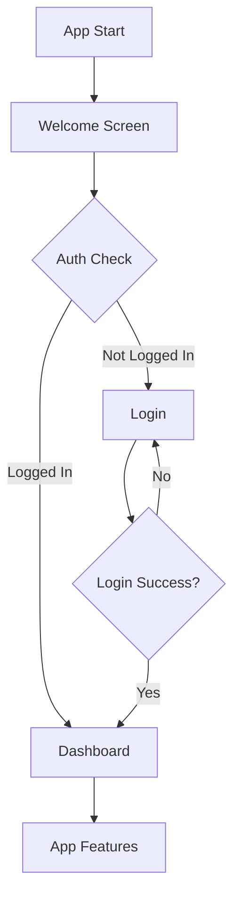

# 🏗️ MediGate Architecture Documentation

## Table of Contents

- [Overview](#overview)
- [Technology Stack](#technology-stack)
- [Project Structure](#project-structure)
- [Design Patterns](#design-patterns)
- [Routing Architecture](#routing-architecture)
- [Responsive Design System](#responsive-design-system)
- [Authentication Flow](#authentication-flow)
- [State Management](#state-management)
- [Error Handling](#error-handling)
- [Performance Optimization](#performance-optimization)
- [Security Considerations](#security-considerations)
- [Future Enhancements](#future-enhancements)

## Overview

MediGate is a cross-platform healthcare mobile application built with React Native and Expo. The application follows a modular, scalable architecture designed to provide a seamless healthcare experience across multiple device types.

### Key Architectural Principles

1. **Separation of Concerns** - Clear division between UI, business logic, and data layers
2. **Reusability** - Component-based architecture with shared UI elements
3. **Scalability** - Modular structure allowing easy feature additions
4. **Responsiveness** - Adaptive design for all screen sizes
5. **Type Safety** - TypeScript for robust type checking
6. **Performance** - Optimized rendering and efficient state management

## Technology Stack

### Core Technologies

```typescript
{
  "platform": "React Native 0.81.5",
  "framework": "Expo ~54.0",
  "language": "TypeScript 5.9",
  "routing": "Expo Router 6.0",
  "styling": "NativeWind 4.2 (TailwindCSS)",
  "icons": "@expo/vector-icons (Ionicons)"
}
```

### Key Dependencies

- **React 19.1.0** - UI library
- **Expo Router** - File-based routing system
- **NativeWind** - TailwindCSS for React Native
- **React Navigation** - Navigation library
- **Expo Vector Icons** - Icon library

## Project Structure

```
medigate-mobile-native/
│
├── app/                          # 📱 Application Screens (Expo Router)
│   ├── index.tsx                # Welcome screen with auto-redirect
│   ├── +not-found.tsx           # 404 error handling
│   ├── account-setup/           # User registration
│   ├── dashboard/               # Main app interface
│   ├── login/                   # Authentication
│   ├── error/                   # Error pages (429, 500)
│   ├── privacy-policy/          # Legal pages
│   └── terms-and-conditions/
│
├── components/                   # 🧩 Reusable Components
│   ├── ui/                      # Base UI components
│   ├── themed-*.tsx             # Theme-aware components
│   └── *.tsx                    # Feature components
│
├── constants/                    # ⚙️ Configuration
│   └── theme.ts                 # Theme constants
│
├── hooks/                        # 🎣 Custom React Hooks
│   ├── use-color-scheme.ts      # Theme detection
│   └── use-theme-color.ts       # Dynamic theming
│
├── assets/                       # 🖼️ Static Resources
│   └── images/                  # Images and icons
│
└── scripts/                      # 🛠️ Build Scripts
```

## Design Patterns

### 1. File-Based Routing (Expo Router)

```
app/
  index.tsx              → /
  login/index.tsx        → /login
  dashboard/index.tsx    → /dashboard
  error/429/index.tsx    → /error/429
```

**Benefits:**
- Automatic route generation
- Type-safe navigation
- Simplified route management
- Better code organization

### 2. Component Composition

```typescript
// Atomic Design Pattern
<Screen>
  <Header>
    <Logo />
    <NavigationMenu />
  </Header>
  <Content>
    <Card>
      <Icon />
      <Text />
    </Card>
  </Content>
  <Footer />
</Screen>
```

### 3. Responsive Design Pattern

```typescript
const { width } = useWindowDimensions();

// Device detection
const isSmartWatch = width < 250;
const isMobile = width >= 250 && width < 768;
const isTablet = width >= 768 && width < 1024;
const isDesktop = width >= 1024 && width < 1920;
const isTV = width >= 1920;

// Conditional rendering based on device
const fontSize = isSmartWatch ? 'text-xs' 
               : isMobile ? 'text-base'
               : isTablet ? 'text-lg' 
               : 'text-xl';
```

## Routing Architecture

### Route Structure

```
/                           # Welcome/Splash (auto-redirect)
├── /login                  # Authentication
├── /account-setup          # Registration
├── /dashboard              # Main app (auth required)
├── /privacy-policy         # Public page
├── /terms-and-conditions   # Public page
├── /error/429             # Rate limit error
├── /error/500             # Server error
└── * (404)                # Not found
```

### Navigation Flow



### Auto-Redirect Implementation

```typescript
useEffect(() => {
  const checkAuthStatus = async () => {
    const isLoggedIn = await checkUserAuth(); // Auth check logic
    
    setTimeout(() => {
      if (isLoggedIn) {
        router.replace('/dashboard');
      } else {
        router.replace('/login');
      }
    }, 2000); // 2-second splash display
  };
  
  checkAuthStatus();
}, []);
```

## Responsive Design System

### Breakpoint System

| Device Type | Width Range | Design Strategy |
|-------------|-------------|-----------------|
| Smartwatch | < 250px | Minimal UI, essential info only |
| Mobile | 250-767px | Touch-optimized, vertical layout |
| Tablet | 768-1023px | Two-column layouts |
| Desktop | 1024-1919px | Multi-column, hover states |
| TV | ≥ 1920px | Large text, simplified navigation |

### Responsive Component Example

```typescript
// Dynamic sizing based on device
const logoSize = isSmartWatch ? 40 
               : isMobile ? 112 
               : isTablet ? 140 
               : isDesktop ? 160 
               : 200;

const containerPadding = isSmartWatch ? 'px-2 py-4'
                       : isMobile ? 'px-6 py-12'
                       : isTablet ? 'px-12 py-16'
                       : isDesktop ? 'px-24 py-20'
                       : 'px-32 py-24';
```

## Authentication Flow

### Authentication States

```typescript
type AuthState = 
  | 'CHECKING'      // Initial auth verification
  | 'AUTHENTICATED' // User logged in
  | 'UNAUTHENTICATED' // User not logged in
  | 'ERROR';        // Auth error occurred
```

### Protected Routes

```typescript
// Middleware for protected routes
const ProtectedRoute = ({ children }) => {
  const { isAuthenticated, isLoading } = useAuth();
  
  if (isLoading) return <LoadingScreen />;
  if (!isAuthenticated) return <Redirect to="/login" />;
  
  return children;
};
```

### Session Management (Future)

```typescript
// Planned implementation
- JWT token storage (SecureStore)
- Auto token refresh
- Session timeout handling
- Biometric authentication
```

## State Management

### Current Architecture

**Local State:** React Hooks (`useState`, `useEffect`)
**Global State:** Context API (planned)
**Server State:** API calls with async/await

### State Structure

```typescript
// Component-level state
const [email, setEmail] = useState('');
const [password, setPassword] = useState('');
const [isLoading, setIsLoading] = useState(false);

// Screen dimensions (responsive)
const { width, height } = useWindowDimensions();

// Navigation state
const router = useRouter();
```

### Future State Management

```typescript
// Planned: Context + Reducer pattern
const AppContext = {
  auth: AuthState,
  user: UserData,
  theme: ThemePreference,
  settings: AppSettings
};
```

## Error Handling

### Error Page Architecture

```
app/error/
├── 429/          # Rate limiting (60s countdown)
├── 500/          # Server errors (retry option)
└── +not-found    # 404 errors (go back/home)
```

### Error Recovery Flow

```typescript
// Rate Limit (429)
1. Display countdown timer (60s)
2. Disable retry button during countdown
3. Enable retry when timer reaches 0
4. Always show "Go Home" option

// Server Error (500)
1. Display friendly error message
2. Offer "Try Again" button
3. Show "Contact Support" link
4. Log error for debugging

// Not Found (404)
1. Display "Page Not Found" message
2. Offer "Go Back" button
3. Offer "Go Home" button
```

## Performance Optimization

### Current Optimizations

1. **Lazy Loading**
   - Images loaded on-demand
   - Route-based code splitting (Expo Router)

2. **Efficient Rendering**
   - Memoized components where needed
   - Optimized re-renders with proper dependencies

3. **ScrollView Optimization**
   - `showsVerticalScrollIndicator={false}`
   - KeyboardAvoidingView for forms

### Planned Optimizations

- Implement React.memo for heavy components
- Add image caching
- Implement virtual lists for long data sets
- Add offline support with local storage
- Implement progressive image loading

## Security Considerations

### Current Implementation

1. **Route Protection**
   - Auto-redirect based on auth status
   - Public routes (privacy, terms) accessible without auth

2. **Input Validation**
   - Email format validation
   - Password strength requirements (planned)

3. **Secure Navigation**
   - `router.replace()` for auth flows (prevents back navigation)

### Planned Security Features

```typescript
// Future implementation
- AsyncStorage encryption for sensitive data
- Expo SecureStore for tokens
- API request encryption
- Certificate pinning
- Biometric authentication
- Two-factor authentication
- Session timeout
- HIPAA compliance measures
```

## Data Flow Architecture

```
User Interaction
      ↓
UI Component (Presentation Layer)
      ↓
Event Handler (Business Logic)
      ↓
API Service (Data Layer)
      ↓
Backend API
      ↓
Database
```

### API Integration Pattern (Planned)

```typescript
// services/api.ts
export const apiClient = {
  auth: {
    login: (credentials) => post('/auth/login', credentials),
    logout: () => post('/auth/logout'),
    refresh: () => post('/auth/refresh')
  },
  appointments: {
    getAll: () => get('/appointments'),
    create: (data) => post('/appointments', data),
    update: (id, data) => put(`/appointments/${id}`, data)
  }
};
```

## Styling Architecture

### NativeWind (TailwindCSS) Approach

```typescript
// Utility-first CSS approach
<View className="flex-1 bg-blue-600 px-6 py-12">
  <Text className="text-3xl font-bold text-white">
    Welcome
  </Text>
</View>

// Responsive classes
<Text className="text-base sm:text-lg md:text-xl lg:text-2xl">
  Responsive Text
</Text>
```

### Theme System

```typescript
// constants/theme.ts
export const theme = {
  colors: {
    primary: '#2563eb',    // blue-600
    secondary: '#dc2626',  // red-600
    accent: '#ea580c',     // orange-600
    success: '#10b981',    // green-500
    error: '#ef4444',      // red-500
  },
  spacing: {
    xs: 4,
    sm: 8,
    md: 16,
    lg: 24,
    xl: 32
  }
};
```

## Testing Strategy (Planned)

### Testing Pyramid

```
                    /\
                   /E2E\           End-to-End Tests
                  /______\
                 /        \
                /Integration\     Integration Tests
               /____________\
              /              \
             /  Unit Tests    \   Unit Tests
            /__________________\
```

### Testing Tools (To be implemented)

- **Unit Tests**: Jest + React Native Testing Library
- **Integration Tests**: Detox
- **E2E Tests**: Appium or Detox
- **API Tests**: Supertest

## Deployment Architecture

### Development Environment

```bash
expo start          # Development server
expo start --ios    # iOS simulator
expo start --android # Android emulator
expo start --web    # Web browser
```

### Production Build

```bash
# EAS Build (Expo Application Services)
eas build --platform android
eas build --platform ios
eas build --platform all

# Submit to stores
eas submit --platform android
eas submit --platform ios
```

## Future Enhancements

### Planned Features

1. **Backend Integration**
   - REST API integration
   - Real-time updates (WebSocket)
   - Push notifications

2. **Advanced Authentication**
   - OAuth2 (Google, Apple, Facebook)
   - Biometric login
   - Two-factor authentication

3. **Offline Support**
   - Local data caching
   - Sync when online
   - Offline queue for actions

4. **Advanced Features**
   - Health data visualization (charts)
   - Telemedicine video calls
   - AI-powered symptom checker
   - Wearable device integration

5. **Analytics & Monitoring**
   - User behavior tracking
   - Error logging (Sentry)
   - Performance monitoring
   - A/B testing framework

## Code Quality Standards

### TypeScript Configuration

```json
{
  "strict": true,
  "noImplicitAny": true,
  "strictNullChecks": true,
  "esModuleInterop": true
}
```

### Code Style Guidelines

- **File naming**: kebab-case for files, PascalCase for components
- **Component structure**: Functional components with hooks
- **Props typing**: Explicit TypeScript interfaces
- **Comments**: JSDoc for complex functions
- **Formatting**: Prettier + ESLint

### Git Workflow

```
main          # Production-ready code
├── develop   # Development branch
│   ├── feature/login
│   ├── feature/dashboard
│   └── bugfix/routing
```

## Monitoring & Analytics (Planned)

### Key Metrics to Track

- User engagement (DAU/MAU)
- Screen view duration
- API response times
- Error rates
- Crash reports
- User flows

### Tools (To be implemented)

- Sentry (Error tracking)
- Google Analytics (User behavior)
- Firebase (Performance monitoring)

---

## Conclusion

This architecture provides a solid foundation for a scalable, maintainable, and performant healthcare application. The modular design allows for easy feature additions while maintaining code quality and user experience across all device types.

For questions or contributions, please refer to the [README.md](./README.md) or open an issue on GitHub.

---

**Last Updated**: November 3, 2025  
**Version**: 1.0.0  
**Author**: MediGate Development Team